Introduction
++++++++++++

Motivation
==========
* The **City Geography Markup Language (CityGML)** is an international OGC standard for the representation and exchange of virtual 3D city and landscape models.
* LoD 1 and LoD 2 models of buildings are available for a `large number of cities and countries <https://github.com/OloOcki/awesome-citygml>`_. 
* Data gathering methods such as Mobile Mapping Systems and emerging applications such as **urban digital twins** begin to shift this focus towards models of **road infrastructure**.
* Several cities (such as New York City, Melbourne, Munich or Singapore) have detailed data on roads and the street space available (usually within an ArcGIS or QGIS environment). However, this data is often structured in different ways (semantically and geometrically). Modelling this data within a common representation framework allows the immediate usage of the data with the same tools for a number of applications. 
* While standards such as GDF or OpenDRIVE focus on linear (graph-based) or parametric representations of roads, **CityGML 3.0** allows linear, polygonal as well as volumetric (explicit) geometries integrated within a **consistent semantic 3D city model** including models of buildings, vegetation, city furniture, tunnels or bridges. 
* CityGML version 3.0 provides **revised and extended concepts** for modelling roads and the streetspace presented and explained in this documentation.

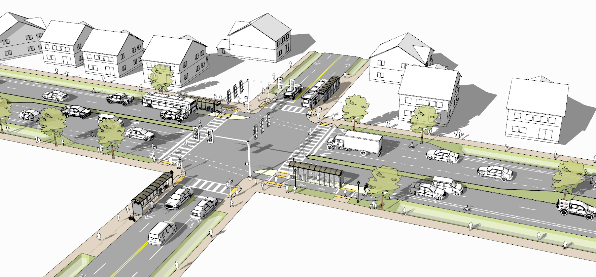
   
   Digital 3D streetspace model including road infrastructure, city furniture, vegetation and buildings.

Scope
=====
* This document provides recommendations for modelling road infrastructure in the context of semantic 3D city models.
* Recommendations are related to the conceptual model of the **Open Geospatial Consortium (OGC)** standard `CityGML version 3.0 <https://www.ogc.org/standards/citygml>`_.
* The CityGML Transportation module defines central elements of the traffic infrastructure. This includes the transportation objects *Road, Track, Railway, Waterway* and *Square*.
* Concepts presented in this document apply to all of these transportation types (and their interactions, e.g. a level crossing of *Road* and *Railway* infrastructure).
* The **focus of this document is on models of Roads** and their parts (including individual driving lanes, pedestrian sidewalks, bike lanes, etc.).
* The CityGML conceptual model allows various geometrical representations for objects such as transportation infrastructure (e.g. linear, volumetric or point clouds). The modelling examples given in this document **focus on surface-based polygonal representations** using explicit geo-referenced geometries.
* Data and modelling examples in this document are based on the **GML encoding** of CityGML.  
* Most **example datasets** presented in section 4 are provided as Open Data.
* In addition to modelling concepts, this document provides (some) data recording recommendations. However, this is not a data recording manual.
* This document can be seen as an addition and extension to the  `CityGML User Guide <https://docs.ogc.org/guides/20-066.html>`_ with a specific focus on modelling roads.

Target group
===============
Municipalities, companies, data providers, mapping agencies and other stakeholders interested in creating and using urban digital twins of road infrastructure and the streetspace in the context of semantic 3D city models. This can include applications such as urban planning and management, automotive applications, environmental simulations and analyses or topographic mapping.
  
References
==========
The conceptual model of CityGML version 3.0 as well as relevant publications in the context of semantic road modelling using CityGML are listed in this section.

   .. [Kolbe2021] Kolbe, T.H., Kutzner, T., Smyth, C. S., Nagel, C., Roensdorf, C., Heazel, C. (2021), OGC City Geography Markup Language (CityGML) Part 1: Conceptual Model Standard, OGC Document 20-010, https://docs.ogc.org/is/20-010/20-010.html 
   .. [Beil2020a] Beil, C., Ruhdorfer, R. Coduro, T., Kolbe, T. H. (2020), Detailed Streetspace Modelling for Multiple Applications: Discussions on the Proposed CityGML 3.0 Transportation Model, ISPRS International Journal of Geo-Information, 9(10), 603, https://doi.org/10.3390/ijgi9100603 
   .. [Beil2020b] Beil, C., & Kolbe, T. H. (2020), Combined modelling of multiple transportation infrastructure within 3D city models and its implementation in CityGML 3.0,  Int. Arch. Photogramm. Remote Sens. Spat. Inf. Sci, VI-4/W1, 29-36, https://doi.org/10.5194/isprs-annals-VI-4-W1-2020-29-2020
   .. [Kutzner2020] Kutzner, T., Chaturvedi, K., Kolbe, T. H. (2020), CityGML 3.0: New functions open up new applications. PFG–Journal of Photogrammetry, Remote Sensing and Geoinformation Science, 88(1), 43-61, https://doi.org/10.1007/s41064-020-00095-z 
   .. [Schwab2020] Schwab, B., Beil, C., Kolbe, T. H. (2020) Spatio-semantic road space modeling for vehicle–pedestrian simulation to test automated driving systems. Sustainability, 12(9), 3799, https://doi.org/10.3390/su12093799 
   .. [Boersma2019] Boersma, F., (2019), Modelling different levels of detail of roads and intersections in 3D city model, Master's Thesis, Delft University of Technology, http://resolver.tudelft.nl/uuid:ebfc48f8-4704-47d3-9654-cd00c765e0af 
   .. [Tamminga2019] Tamminga, G. (2019), A Novel Design of the Transport Infrastructure for Traffic Simulation Models, PhD Thesis, Delft University of Technology, https://doi.org/10.4233/uuid:35d2e152-0cfe-439e-a276-da4a69b11acd
   .. [Labetski2018] Labetski, A., van Gerwen, S.,  Tamminga, G.,  Ledoux, H., Stoter, J. (2018), A proposal for an improved transportation model in CityGML, Int. Arch. Photogramm. Remote Sens. Spat. Inf. Sci, XLII-4/W10, 89--96, https://doi.org/10.5194/isprs-archives-XLII-4-W10-89-2018   
   .. [Beil2017] Beil, C., & Kolbe, T. H. (2017), CityGML and the streets of New York - A proposal for detailed street space modelling,  Int. Arch. Photogramm. Remote Sens. Spat. Inf. Sci, IV-4/W5, 9-16, https://doi.org/10.5194/isprs-annals-IV-4-W5-9-2017  

Data downloads
===============
.. tip::
   * Most examples datasets presented in in section 4  can be downloaded from `this repository <https://github.com/opengeospatial/CityGML-3.0Encodings/tree/master/CityGML/Examples/Transportation>`_.
   * This includes  `basic <https://github.com/opengeospatial/CityGML-3.0Encodings/tree/master/CityGML/Examples/Transportation/Basic%20examples>`_ as well as `real-world <https://github.com/opengeospatial/CityGML-3.0Encodings/tree/master/CityGML/Examples/Transportation/Real-world%20examples>`_ examples.

.. tip::
   * The open-source converter r:trån reads road network models in the OpenDRIVE data format and transforms them to the virtual 3D city model standard CityGML (versions 2.0 and 3.0).
   * Find more information on this converter on the corresponding `GitHub page. <https://github.com/tum-gis/rtron>`_ 

Licence and disclaimer
==============================
.. note:: 
   * This guideline is licenced under the `Creative Commons Attribution 4.0 International (CC BY 4.0) <https://creativecommons.org/licenses/by/4.0/>`_ licence.
   * The provided datasets are free for usage. 
   * No warranties or guarantee on the correctness, completeness, or appropriateness of the provided datasets for any specific use is given. 
   * In no case can the data providers be held liable for damages, caused directly or indirectly, by using or working with these datasets or software tools.  
   * Since the data provided here has been derived from Open Data, all original terms of use and conditions apply here too.
   * Aerial imagery included in this document is derived from Open Data sources.  

General concepts and definitions
+++++++++++++++++++++++++++++++++
General concepts and definitions of the CityGML 3.0 conceptual model, important in the context of modelling roads are summarized in this section. For more detailed explanations on these general concepts please refer to the CityGML 3.0 `standard document <https://www.ogc.org/standards/citygml>`_. 

The CityGML 3.0 Transportation module
======================================

* The CityGML Conceptual Model uses a modularized structure and provides models for the most important types of objects within virtual 3D city and landscape models.
* This includes a Transportation module for roads and other transportation infrastructure. 
* The UML diagram of the CityGML 3.0 Transportation module is shown in :numref:`uml_TPmodel`.
* For other relevant modules such as the Core module please refer to the `CityGML standard document <https://www.ogc.org/standards/citygml>`_.
* Real-world objects are represented by geographic features according to the definition in ISO 19109.
* Geographic features of the same type (e.g. *Roads*) are modelled by corresponding feature types that are represented as classes in the Conceptual Model.
* Following a hierarchical structure, the specific feature types like *Roads* are defined as subclasses of more general higher-level classes.
* *Roads, Railways, Tracks* and *Waterways* can be segmented into individual *Sections* and *Intersections*, which can be further segmented into individual *(Auxiliary)TrafficSpaces*, which again can be bounded towards the ground by *(Auxiliary)TrafficAreas*. 

.. _uml_TPmodel:

   
   UML diagram of the CityGML 3.0 Transportation module. 

Semantic concepts
====================

Modelling spaces and space boundaries
----------------------------------------
In the CityGML 3.0 Conceptual Model, a clear semantic distinction of spatial features is introduced by mapping all city objects onto the semantic concepts of spaces and space boundaries.

.. admonition:: Definitions
   :class: important

   * A **space** is an entity of volumetric extent in the real world. *Buildings, Waterbodies, Vegetation, Rooms,* and *TrafficSpaces* are examples for such entities with volumetric extent.
   * A **space boundary** is an entity with areal extent in the real world. Space boundaries delimit and connect spaces. 

* FeatureTypes such as *Road, Railway, Track, Waterway* or *Square* are subclasses of the abstract class *AbstractTransportationSpace*.
* Transportation objects are not just represented by their surface but also consider the space above used for transportation.
* Concepts of *(Auxiliary)TrafficSpaces* bounded by corresponding *(Auxiliary)TrafficAreas* are explained in more detail in the respective chapters of this document.

Three levels of granularity
----------------------------
For defining different levels of semantic decomposition for transportation objects, three levels of granularity are introduced.

.. admonition:: Definitions
   :class: important

   * In **granularity 'area'** the entire width of a *Road* is modelled with one single object. This corresponds to the extent of a *Section* or *Intersection*.
   * In **granularity 'way'** individual objects are modelled per surface function (or traffic type). This means one object per carriageway is used. Sidewalks, bicycle paths, pedestrian crossings, parking bays, etc. can be modelled as individual objects.
   * In **granularity 'lane'** each individual lane (including driving lanes for vehicles) are modelled separately. 

* These three levels of granularity can be modelled geometrically using linear or polygonal representations (corresponding volumetric representations can be created by extruding the polygonal surface representation). 
* Examples for these three levels of granularity for polygonal (surface-based) representations are given in :numref:`granularity`. 
* For the linear representations one centerline is used to model the entire *Road*. In granularity 'way' individual lines are used for carriageways and pedestrian or bicycle paths. In granularity 'lane' each driving lane is modelled with an individual linear representation. 

.. _granularity:

   
   Three levels of granularity (lane, way and area) for representing *Roads*. 

Required and recommended attributes
---------------------------------------

.. admonition:: Required
   :class: attention

   * In order to distinguish and reference individual objects, each object has to have a unique identifier (*gml:id*). 
   * *(Auxiliary)TrafficSpaces* require a *granularity* attribute (way or lane).

.. admonition:: Recommended
   :class: note

   * *Road* objects should contain an individual *gml:name* attribute.
   * *Sections* and *Intersections* should contain information to which *Road(s)* they belong. This can be achieved by corresponding *gml:name* attribute(s).
   * *TrafficSpaces* should contain information which *Section* or *Intersection* they belong to. This is implicitly given due to the hierarchal file structure of a GML encoded CityGML document.
   * *(Auxiliary)TrafficAreas* should contain a *function* attribute indicating their type (e.g. driving lane, sidewalk, parking lane, bike lane, etc.)
   * *(Auxiliary)TrafficAreas* can contain a *surface material* attribute.
 

Codelists
-----------
Codelists for the CityGML 2.0 Transportation module as defined by the Special Interest Group 3D (SIG3D) are available `here <https://www.sig3d.org/codelists/standard/transportation/>`_. This includes codelists for *(Auxiliary)TrafficAreas* and *TransportationComplex* objects (e.g. *Roads*). These can be transferred and applied to respective CityGML 3.0 classes.  

The following tables provide recommendations for *AuxiliaryTrafficAreas* and *TrafficAreas* that should be explicitly modelled by providing respective *usage* and *function* attributes. Multiple *usage* and *function* attributes can be modelled per *AuxiliaryTrafficAreas* and *TrafficAreas*.  
*Function* describes surface types such as driving lane, footpath, or cycle lane, while the *usage* attribute indicates which modes of transportation can use it (e.g. pedestrian, car, tram).

.. list-table:: Recommended TrafficArea 'usage' attributes.
   :widths: 40 40 
   :header-rows: 1

   * - citygml_usage (text)
     - citygml_usage (code)
     
   * - pedestrian
     - 1
   * - car
     - 2
   * - truck
     - 3
   * - bus, taxi
     - 4
   * - train
     - 5
   * - bicycle
     - 6
   * - motorcycle
     - 7
   * - tram
     - 8
   * - emergency
     - 15

.. list-table:: Recommended TrafficArea 'function' attributes.
   :widths: 25 25 
   :header-rows: 1

   * - citygml_function (text)
     - citygml_function (code)
     
   * - driving_lane
     - 1
   * - footpath
     - 2
   * - cyclepath
     - 3
   * - combined foot-/cyclepath
     - 4
   * - square
     - 5
   * - parking_lay_by
     - 7
   * - rail
     - 8
   * - rail_road_combined
     - 9
   * - crosswalk
     - 20
   * - bus_lay_by
     - 32
   * - motorway
     - 33
   * - emergency_lane
     - 36
   * - road_works
     - 37 
   * - unknown
     - 9999

.. list-table:: Recommended AuxiliaryTrafficArea 'function' attributes.
   :widths: 25 25 
   :header-rows: 1

   * - citygml_function (text)
     - citygml_function (code)
     
   * - shoulder
     - 1010
   * - green_area
     - 1020
   * - kerbstone
     - 1220
   * - restricted
     - 1240
   * - traffic_island
     - 1300
   * - raised_median
     - 1400
   * - low kerbstone
     - 1500
   * - border
     - 1600
   
The attribute *surfaceMaterial* specifies the type of pavement and can be used by *AuxiliaryTrafficAreas* and *TrafficAreas*. 

.. list-table:: Recommended AuxiliaryTrafficArea and TrafficArea 'surfaceMaterial' attributes.
   :widths: 25 25 
   :header-rows: 1

   * - citygml_surfaceMaterial (text)
     - citygml_surfaceMaterial (code)
     
   * - asphalt
     - 1
   * - concrete
     - 2
   * - pavement
     - 3
   * - cobblestone
     - 4
   * - gravel
     - 5
   * - soil
     - 8
   * - sand
     - 9
   * - grass
     - 10

Generic attributes
-------------------------------
* While CityGML provides some standardized attributes such as *function*, *usage* or *surface material*, it is possible to create and use *generic attributes*.
* *(Auxiliary)TrafficAreas* should contain information on individual surface areas (e.g. in square meter) as generic attributes.
* Depending on intended applications additional generic attributes are possible (e.g. pavement rating, maximum speed, number of lanes, etc.).

Geometric representations
==========================
* Spatial properties of all CityGML feature types are represented using the geometry classes defined in ISO 19107. 
* Spatial representations can have 0-, 1-, 2-, or 3-dimensional extents depending on the respective feature type and Levels of Detail.
* CityGML makes use of different kinds of aggregations of geometries like spatial aggregates (*MultiPoint, MultiCurve, MultiSurface, MultiSolid*) and composites (*CompositeCurve, CompositeSurface, CompositeSolid*).
* Volumetric shapes are represented in ISO 19107 according to the so-called *Boundary Representation (B-Rep)*. 
* CityGML 3.0 supports point cloud geometries. Point clouds can either be provided inline within a CityGML file or as reference to external point cloud files of common file types such as `LAS <https://www.ogc.org/standards/LAS>`_ or LAZ.
* Recommendations for modelling *Roads* using polygonal (surface-based) representations are given in this document.
* For more general recommendations on using geometries in CityGML, please refer to `this guideline <https://en.wiki.quality.sig3d.org/index.php?title=Modeling_Guide_for_3D_Objects_-_Part_1:_Basics_(Rules_for_Validating_GML_Geometries_in_CityGML)>`_

Coordinate Reference Systems
-------------------------------

* Nearly all geometries in CityGML use 3D coordinates.
* Single points and also the points defining the boundaries of surfaces and solids have three coordinate values (x,y,z) each. 
* Coordinates always have to be given with respect to a Coordinate Reference System (CRS) that relates them unambiguously with a specific position on the Earth. 
* In contrast to CAD or BIM, each 3D point is absolutely georeferenced, which makes CityGML especially suitable to represent geographically large extended structures like roads, where the Earth curvature has a significant effect on the object’s geometry.
* In most CRS, the (x,y) coordinates refer to the horizontal position of a point on the Earth’s surface. The z coordinate typically refers to the vertical height over (or under) the reference surface. 
* Note that depending on the chosen CRS, x and y may be given as angular values like latitude and longitude or as distance values in meters or feet. 
* According to ISO 19111, numerous 3D CRS can be used. This includes global as well as national reference systems using geocentric, geodetic, or projected coordinate systems.

Levels of Detail (LoD)
-------------------------

* The CityGML Conceptual Model differentiates four consecutive Levels of Detail (LOD 0-3).
* CityGML datasets can (but do not have to) contain multiple geometries for each object in different LODs simultaneously.
* Levels of Detail are no longer associated with the degree of semantic decomposition of city objects and refer to the spatial representations only. 
* In order to maintain the ability for a semantic decomposition of transportation objects, three levels of granularity are introduced.

Adaption to the terrain
----------------------------
* Data on road infrastructure are often provided as 2D data with a base height of 0 meter.
* For adapting this data to the terrain it is recommended to create a terrain with breaklines of individual *(Auxiliary)TrafficAreas*.
* Triangles of this new terrain, that are part of individual *(Auxiliary)TrafficAreas*, can then be used to represent the geometry of those surfaces.

Subtle 3D structures such as raised medians
------------------------------------------------------------
* In addition to the adaption of road surfaces to the terrain, subtle geometric features such as kerbstones or traffic islands can be modelled. 
* It is recommended to derive these structures from 2D data by extruding respective *(Auxiliary)TrafficAreas* by a certain amount (e.g. 0.15m).
* MultiSurface geometries are recommended for these objects.

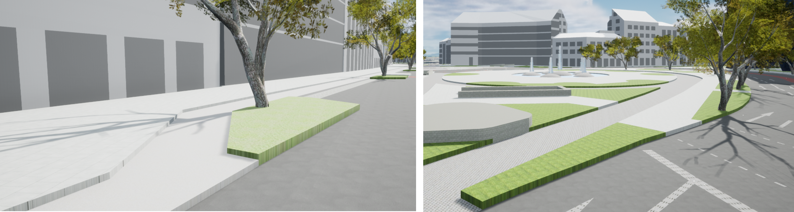
   
   Modelling raised sidewalks, kerbstones or medians.

Topological concepts
===========================

Predecessor / Successor relations
------------------------------------
* *TrafficSpaces* can contain information about respective predecessors and successors using the XLink concept.
* This is especially recommended for linear representations of *TrafficSpaces* in *granularity 'lane'* (e.g. to support routing applications). 
* However, this is also available for other geometric representations and granularities of *TrafficSpaces*.

XLinks
---------
* XLinks are an XML specific concept for representing topology.
* Each geometry object that should be shared by different geometric aggregates or different thematic features is assigned an unique identifier, which may be referenced by a GML geometry property using a *href* attribute.
* *Intersections* for example can be linked to multiples *Roads* simultaneously.
* This allows a non-redundant geometrical representation of *Intersections*, while indicating their affiliation with multiple *Roads*.
* Advantage: Semantically and geometrically identical objects do not need to be represented multiple times.
* Disadvantage: In large files, linked objects may be stored very far apart. 

CityObjectRelations
---------------------------
* Using *CityObjectRelations* makes sense for linking semantically different but geometrically identical surfaces / objects.
* *CityObjectRelations* are realised using *XLinks*, indicating relations and their type between objects.
* Advantage: Geometry of each object is stored directly with the object. Information on identical (geometrically equal) surfaces is available.
* Disadvantage: Geometry of objects / surfaces needs to be represented redundantly.

Appearance
===========================
* The CityGML *Appearance* module provides the representation of surface data such as observable properties for surface geometry objects in the form of textures and material.
* For *Road* surfaces this may be corresponding colors, synthetic textures (e.g. asphalt) or aerial images (e.g. a high resolution digital orthophoto).
* Appearances are not limited to visual data but represent arbitrary categories called themes (such as solar irradiation for urban heat islands, infrared radiation or noise pollution).
* For the visualization of road infrastructure, it might be necessary to offset road surface geometries slightly above the ground in order to avoid rendering problems (z-fighting) with underlying models of the terrain. 

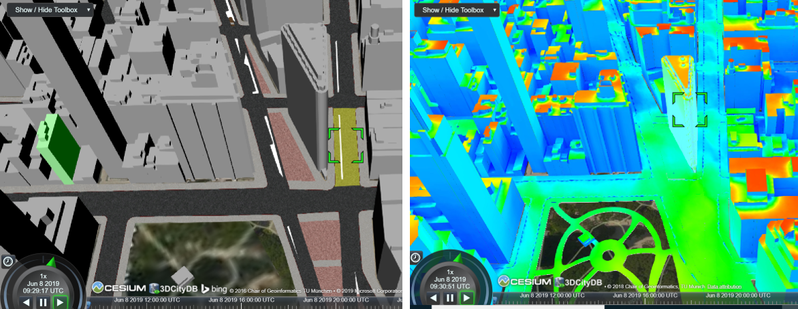

   Different appearances for road surfaces. Synthetic textures (left). Results of a solar irradiation simulation (right).

Modelling Roads according to concepts of CityGML 3.0
+++++++++++++++++++++++++++++++++++++++++++++++++++++++
The following modelling examples are illustrated using semantic 3D city and streetspace models from different cities such as Melbourne, New York, Munich or Ingolstadt. 

Roads
===========================
Transportation objects such as *Roads, Tracks,* or *Railways* are defined as specific subclasses of the abstract class *AbstractTransportationSpace*.

.. admonition:: Definition
   :class: important
   
   A **Road** is a transportation space used by vehicles, bicycles and/or pedestrians.

.. admonition:: Each Road

   * **must** contain a unique *gml:id* attribute. 
   * **should** be distinguished by individual names stored as a *gml:name* attribute.
   * **should** cover the entire width of corresponding transportation infrastructure including sidewalks, bicycle lanes, etc., adjacent to carriageways.
   * **should** consist of individual *Sections* and *Intersections*. 
   * **can** contain multiple *function* and *usage* attributes.
   * **can** contain a *class* attribute. 

* In case multiple (disconnected) roads within one city model have the same name, individual *Road* objects per road should be created.
* In case a *Road* does not have a name, logical aggregations of underlying *Sections* and *Intersections* should be performed.
* Multiple *Roads* can share the same *Intersection*.
* Long uninterrupted *Roads* (e.g. freeways or motorways) can be segmented into multiple *Sections* directly connected to each other (without intermediate *Intersections*).
* :numref:`roads1` shows three *Road* objects highlighted in purple, yellow and green. Note that these *Roads* have shared *Intersections*

.. _roads1:
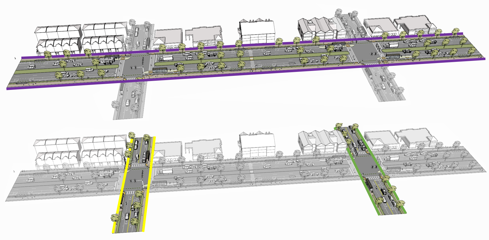
   
   Three *Road* objects highlighted in purple, yellow and green with shared *Intersections*. 

Sections and Intersections
================================

*Roads* (or *Tracks, Railways, Waterways*) should be decomposed into individual *Sections* and *Intersections*.

.. admonition:: Sections and Intersections
  
   * **must** contain a unique *gml:id* attribute. 
   * **should** cover the entire width of a *Road* and thus directly correspond to the representation of transportation objects in granularity 'area'.
   * **can** contain a *class* attribute.
   * **do not** need to alternate. In some cases it might be useful to have individual *Sections* directly next to each other. 
 

Sections
-----------

.. admonition:: Definition
   :class: important
   
   A **Section** is a transportation segment that can clearly be assigned to one *Road* (or *Railway, Track, Waterway*) object.

.. admonition:: Each Section
   
   * **should** indicate its type (e.g. road corridor, dead end, etc.) by a corresponding *class* attribute.

.. _fig_sections:

   Typical example of a *Section* (surrounded with orange lines) between two intersections.

Intersections
--------------

.. admonition:: Definition
   :class: important
   
   An **Intersection** is a transportation space that is a shared segment of multiple *Roads* or other transportation objects such as Railways (e.g. a crossing of two *Roads* or a level crossing of a *Road* and a *Railway*).

.. admonition:: Each Intersection
  
   * **should** indicate affiliations to multiple *Roads* with multiple *gml:name* attributes (one for each *Road* they belong to).
   * **should** indicate its type (e.g. Y-Intersection, T-Intersection, 4-way Intersection, roundabout, etc.) using a corresponding *class* attribute.
   * **can** be shared by multiple *Roads* using mentioned XLink concept.

* Depending on intended use-cases, different definitions of the extent of individual *Intersections* are possible. 
* It is recommended to model *Intersections* with the minimal extent of surfaces shared by multiple *Roads*. However, it is not prohibited to expand *Intersection* objects into adjacent *Sections*. 

.. _fig_intersectiondef:

   

   Two *Intersections* (highlighted in blue).

TrafficSpaces and AuxiliaryTrafficSpaces
==========================================
* Transportation objects are not just represented by their surface but also consider the space above used for transportation.
* *Sections* and *Intersections* should consist of multiple *AuxiliaryTrafficSpaces* and *TrafficSpaces*.
* *(Auxiliary)TrafficSpace* represent the (typically free) space above corresponding *(Auxiliary)TrafficAreas*.

.. admonition:: Definitions
   :class: important
   
   * A **TrafficSpace** is a space in which traffic takes place. Traffic includes the movement of entities such as cars, trains, vehicles, pedestrians, ships, or other transportation types.
   * An **AuxiliaryTrafficSpace** is a space within the transportation space not intended for traffic purposes.

.. admonition:: Each (Auxiliary)TrafficSpace
  
   * **must** contain a unique *gml:id* attribute.
   * **must** contain a *granularity* attribute ('way' or 'lane').
   * **should** contain a *function* attribute indicating the type of *(Auxiliary)TrafficSpaces*.
   * **can** contain a *class* attribute.
   * **can** contain multiple *function* attributes.
   * **can** contain multiple *usage* attributes indicating which types of traffic members use certain spaces.

.. admonition:: Each TrafficSpace additionally
  
   * **can** contain a *traffic direction* attribute (forwards, backwards or both).
   * **can** contain an *occupancy* attribute (e.g. to indicate the number of pedestrians using a particular TrafficSpace at a certain time).
   * **can** have an optional *ClearanceSpace*.
  
* Multiple *TrafficSpaces* can be linked using the predecessor / successor concept.
* Volumetric or linear representations are recommended for modelling individual *(Auxiliary)TrafficSpaces*. Point cloud geometries are also possible.
* Volumetric representations of *(Auxiliary)TrafficSpaces* can be generated by extruding corresponding *(Auxiliary)TrafficAreas* by a certain amount.
* In Germany, for example, car driving lanes typically have a free space height of 4.5 m and sidewalks of 2.5 m. This can be modelled using volumetric geometries.
* *(Auxiliary)TrafficSpaces* do not have to be represented geometrically but should be bounded towards the ground by corresponding *(Auxiliary)TrafficAreas*. 

.. _fig_trafficspace:
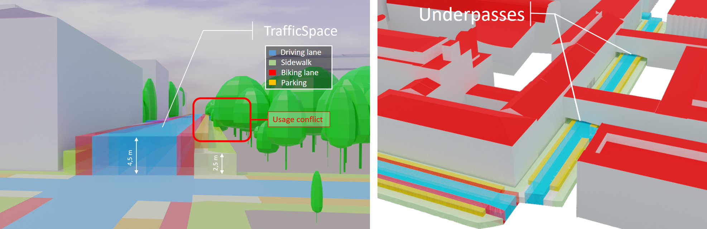
   
   Volumetric representations of *TrafficSpaces* with different heights according to respective functions (left), *TrafficSpaces* underneath Building underpasses (right).

 

TrafficAreas and AuxiliaryTrafficAreas
==========================================

.. admonition:: Definitions
   :class: important
   
   * A **TrafficArea** is the ground surface of a *TrafficSpace*. *TrafficAreas* are the surfaces upon which traffic actually takes place, such as car driving lanes, pedestrian sidewalks or bicycle lanes.   
   * An **AuxiliaryTrafficArea** is the ground surface of an *AuxiliaryTrafficSpace*. *AuxiliaryTrafficAreas* are describing further elements of the *Road*, like kerbstones, raised medians, and green areas not intended for direct traffic usage.

  
.. admonition:: Each (Auxiliary)TrafficArea

   * **must** contain a unique *gml:id* attribute.
   * **should** contain a *function* attribute indicating the type of (Auxiliary)TrafficAreas (e.g. driving lane, sidewalk, median, etc.). 
   * **can** contain a *class* attribute.
   * **can** contain multiple *function* attributes. A pedestrian crossing for example can contain a *function* 'driving lane' as well as a *function* 'footpath'.
   * **can** contain multiple *usage* attributes indicating which types of traffic members use certain surfaces (e.g. cars, pedestrians or bicyclists).
   * **should not** have overlapping geometries but rather be represented with separate (Auxiliary)TrafficAreas with multiple *function* attributes. 

.. _fig_sections1:
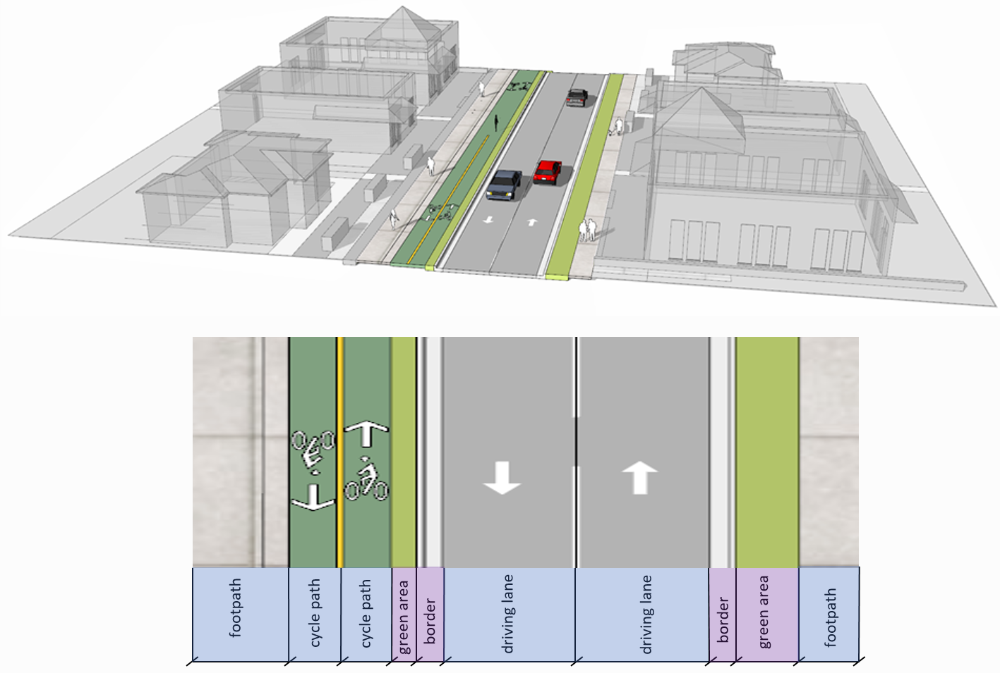

   *Section* with one carriageway decomposed into individual *TrafficAreas* (blue) and *AuxiliaryTrafficAreas* (purple). 

   
.. _fig_sections2:
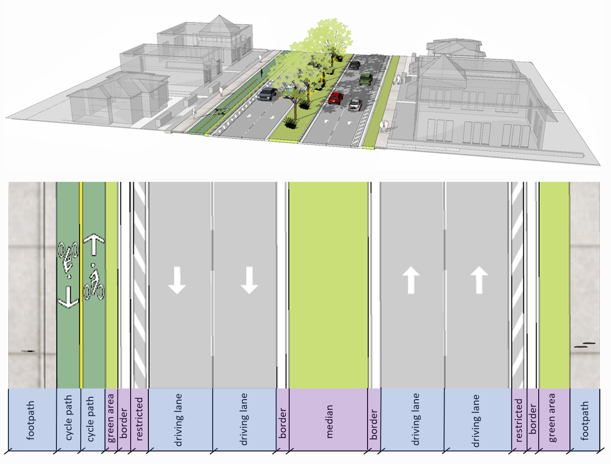

   *Section* with two carriageways decomposed into individual *TrafficAreas* (blue) and *AuxiliaryTrafficAreas* (purple). 

.. _fig_sections3:
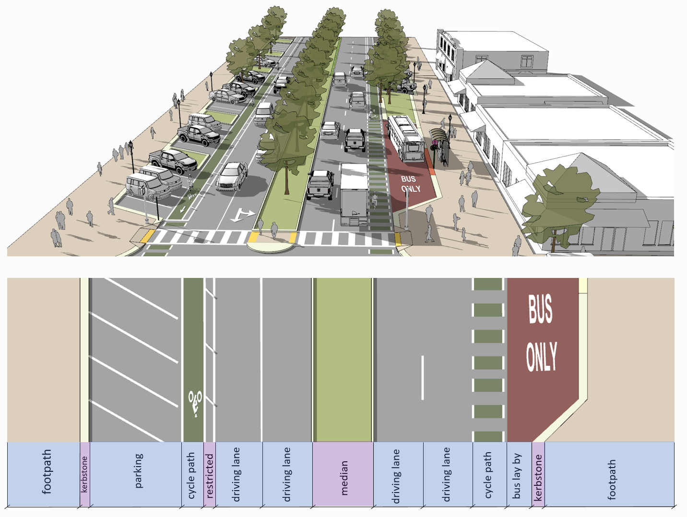

   *Section* with two carriageways decomposed into individual *TrafficAreas* (blue) including parking and bus lanes and *AuxiliaryTrafficAreas* (purple). 

Clearance Spaces
===========================

.. admonition:: Definition
   :class: important

   A **ClearanceSpace** represents the actual free space above a *TrafficArea* within which a mobile object can move without contacting an obstruction.

.. admonition:: Each ClearanceSpace
   
   * **must** contain a unique *gml:id* attribute.
   * **should** be represented using volumetric geometries.
   * **can** contain a *class* attribute.

 

Markings
==========================================
*Markings* are modelled as an individual class.

.. admonition:: Definition
   :class: important
   
   A **Marking** is a visible pattern on a transportation area relevant to the structuring or restriction of traffic. Examples are road markings and markings related to railway or waterway traffic.
  
.. admonition:: Each Marking
  
   * **must** contain a unique *gml:id* attribute.
   * **should** contain a *class* attribute indicating its type.
   * **should** be represented as additional surfaces independent of level of *granularity*. 
   * **should** be represented with individual objects for each *Marking*. 
   * **should** be represented using polygonal geometries depicting the actual shape of each *Marking*.
   * **can** span over multiple *(Auxiliary)TrafficAreas*.
   * **can** be linked to a corresponding *TrafficArea* via a *CityObjectRelation* (e.g. to indicate the validity of a marking for a certain lane).
  
* Individual lines part of a dashed line e.g. can also be aggregated.
* Colored surfaces (e.g. a red or green bicycle path) should not be modelled as *Markings* but as corresponding *TrafficAreas* with a suitable color or texture.

.. _fig_markings:
.. figure:: ../figures/markings.PNG
   :align: center
   
   
   Different types of *Markings* including stop lines, dashed lines, arrows and zebra crossings.

.. list-table:: Recommended Marking 'class' attributes.
   :widths: 40 40 
   :header-rows: 1

   * - citygml_class (text)
     - citygml_class (code)
     
   * - road_marking
     - 11
   * - road_marking_direction
     - 12
   * - road_marking_lane
     - 13
   * - road_marking_restricted
     - 14
   * - road_marking_crosswalk
     - 15
   * - road_marking_stop
     - 16
   * - arrowRight
     - 121
   * - arrowLeft
     - 122
   * - arrowStraight
     - 123
   * - arrowStraightRight
     - 124
   * - arrowStraightLeft
     - 125
   * - road_marking_lane_broken
     - 131
   * - road_marking_lane_solid
     - 132
   * - symbol_bicycle
     - 140
   * - symbol_other
     - 150

Holes
==========================================
*Holes* are modelled as an individudal class.
  
.. admonition:: Definition
   :class: important
  
   A **Hole** is an opening in the surface of a *Road, Track* or *Square* such as road damages, manholes or drains. Holes can span multiple transportation objects.

.. admonition:: Each Hole
  
   * **must** contain a unique *gml:id* attribute.
   * **can** contain an *class* attribute indicating its type.

.. admonition:: Definition
   :class: important

   * A **HoleSurface** is a representation of the ground surface of a hole.

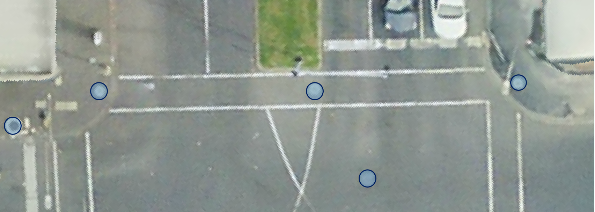
   
   Manhole covers modelled as *Holes*.

Tracks
================================

.. admonition:: Definition
   :class: important
   
   A **Track** is a small path mainly used by pedestrians.

.. admonition:: Each Track 
  
   * **must** contain a unique *gml:id* attribute. 
   * **should** consist of individual *Sections* and *Intersections*.
   * **can** contain multiple *function* and *usage* attributes.
   * **can** contain a *class* attribute. 
  
.. _fig_tracks:
.. figure:: ../figures/tracks.PNG
   :align: center

   *TrafficAreas* part of Tracks within a park.

Squares
================================

.. admonition:: Definition
   :class: important
   
   A **Square** is a transportation space for unrestricted movement of vehicles, bicycles and/or pedestrians. This includes plazas as well as large sealed surfaces such as parking lots or gas stations.

.. admonition:: Each Square

   * **must** contain a unique *gml:id* attribute.
   * **is not** segmented into *Sections* and *Intersections* 
   * **should** contain a *function* attribute indicating the type (e.g. parking lot or plaza).
   * **can** contain multiple *function* and *usage* attributes.
   * **can** be segmented into individual *(Auxiliary)TrafficSpaces* bounded by *(Auxiliary)TrafficAreas*. Individual parking slots within a bigger parking lot for example can be modelled as individual *TrafficAreas*.

.. _fig_square: 
.. figure:: ../figures/square.PNG
   :align: center
   

   A parking lot segmented into individual *TrafficAreas* (parking slots and driving surfaces) modelled as a *Square*.

.. _fig_plaza:   
.. figure:: ../figures/plaza.PNG
   :align: center
   

   A plaza modelled as a *Square* surrounded by *Tracks*.

Modelling examples
+++++++++++++++++++++++++++
* The following examples are intended to illustrate modelling concepts of the CityGML 3.0 Transportation module. Most corresponding datasets are provided as open data. 
* First, examples of individual *Sections* and *Intersections* with corresponding *(Auxiliary)TrafficSpaces* and *(Auxiliary)TrafficAreas* are shown. 
* Then, it is shown how more complex scenarios can be segmented into *Sections* and *Intersections* as well.

Individual Section with one carriageway
==========================================
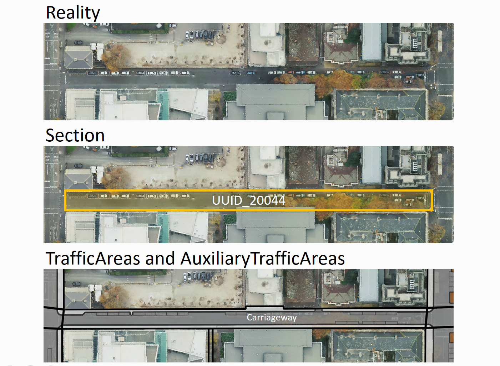

   Individual Section with one carriageway.

.. _xml_onesection:
.. code-block:: xml
   :caption: Individual Section with one carriageway in granularity 'way'.

   <core:cityObjectMember>
      <tran:Road gml:id="UUID_Little_Lonsdale_Street">
         <gml:name>Little_Lonsdale_Street</gml:name>
         <tran:section>
            <tran:Section gml:id="UUID_20044">
               <tran:trafficSpace>
                  <tran:TrafficSpace gml:id="UUID_TS_id_4c95049e-1b96-4a39-b678-29ce209cddb5">
                     <core:boundary>
                        <tran:TrafficArea gml:id="UUID_TA_0bd21839-0ced-4660-8c21-75dbf633ec7a">
                           <tran:function>Carriageway</tran:function>
                           <!Additional attributes such as area in sqm, surface material, etc.>
                           <core:lod2MultiSurface>
                              <gml:MultiSurface srsName="EPSG:32755" srsDimension="3">
                                 <!Geometry definition>
                              </gml:MultiSurface>
                           </core:lod2MultiSurface>
                        </tran:TrafficArea>
                     </core:boundary>
                     <tran:granularity>way</tran:granularity>
                  </tran:TrafficSpace>
               </tran:trafficSpace>
               <!Additional (Auxiliary)TrafficSpaces with corresponding (Auxiliary)TrafficAreas>
            </tran:Section>
         </tran:section>
      </tran:Road>
   </core:cityObjectMember>

Individual Section with two carriageways
==========================================

   Individual Section with two  carriageways.

.. code-block:: xml
   :caption: Individual Section with two carriageways in granularity 'way'.

   <core:cityObjectMember>
      <tran:Road gml:id="UUID_Lygon_Street">
         <gml:name>Lygon_Street</gml:name>
         <tran:section>
            <tran:Section gml:id="UUID_20522">
               <tran:trafficSpace>
                  <tran:TrafficSpace gml:id="UUID_TS_id_5c249b72-82c3-47ef-9be3-e3de6340c6cd">
                     <core:boundary>
                        <tran:TrafficArea gml:id="UUID_TA_72cc6ac7-caf4-439b-b08a-707c5dd3f506">
                           <tran:function>Carriageway</tran:function>
                           <!Additional attributes such as area in sqm, surface material, etc.>
                           <core:lod2MultiSurface>
                              <gml:MultiSurface srsName="EPSG:32755" srsDimension="3">
                                 <!Geometry definition>
                              </gml:MultiSurface>
                           </core:lod2MultiSurface>
                        </tran:TrafficArea>
                     </core:boundary>
                     <tran:granularity>way</tran:granularity>
                  </tran:TrafficSpace>
               </tran:trafficSpace>
               <tran:trafficSpace>
                  <tran:TrafficSpace gml:id="UUID_TS_id_cdbf9131-027f-425f-a355-f605d04a4f84">
                     <core:boundary>
                        <tran:TrafficArea gml:id="UUID_TA_ae280a29-8d9a-49c0-bf74-ffea469290d6">
                           <tran:function>Carriageway</tran:function>
                           <!Additional attributes such as area in sqm, surface material, etc.>
                           <core:lod2MultiSurface>
                              <gml:MultiSurface srsName="EPSG:32755" srsDimension="3">
                                 <!Geometry definition>
                              </gml:MultiSurface>
                           </core:lod2MultiSurface>
                        </tran:TrafficArea>
                     </core:boundary>
                     <tran:granularity>way</tran:granularity>
                  </tran:TrafficSpace>
               </tran:trafficSpace>
               <!Additional (Auxiliary)TrafficSpaces with corresponding (Auxiliary)TrafficAreas>
            </tran:Section>
         </tran:section>
      </tran:Road>
   </core:cityObjectMember>
   

Three-way Intersection
==========================================

   Intersection with three adjacent Sections.

.. code-block:: xml
   :caption: Intersection with three adjacent Sections.

   <core:cityObjectMember>
      <tran:Road gml:id="UUID_Queensberry_Street">
         <gml:name>Queensberry_Street</gml:name>
         <tran:section>
            <tran:Section gml:id="UUID_22497">
               <!(Auxiliary)TrafficSpaces with corresponding (Auxiliary)TrafficAreas>
            </tran:Section>
         </tran:section>
      </tran:Road>
   </core:cityObjectMember>
   <core:cityObjectMember>
      <tran:Road gml:id="UUID_Rathdowne_Street">
         <gml:name>Rathdowne_Street</gml:name>
         <tran:section>
            <tran:Section gml:id="UUID_20554">
               <!(Auxiliary)TrafficSpaces with corresponding (Auxiliary)TrafficAreas>
            </tran:Section>
         </tran:section>
         <tran:section>
            <tran:Section gml:id="UUID_20556">
               <!(Auxiliary)TrafficSpaces with corresponding (Auxiliary)TrafficAreas>
            </tran:Section>
         </tran:section>
         <tran:intersection>
            <tran:Intersection gml:id="UUID_20555">
            <gml:name>Queensberry_Street</gml:name>
            <gml:name>Rathdowne_Street</gml:name>
               <!(Auxiliary)TrafficSpaces with corresponding (Auxiliary)TrafficAreas>
            </tran:Intersection>
         </tran:intersection>
      </tran:Road>
   </core:cityObjectMember>

Four-way Intersection
==========================================

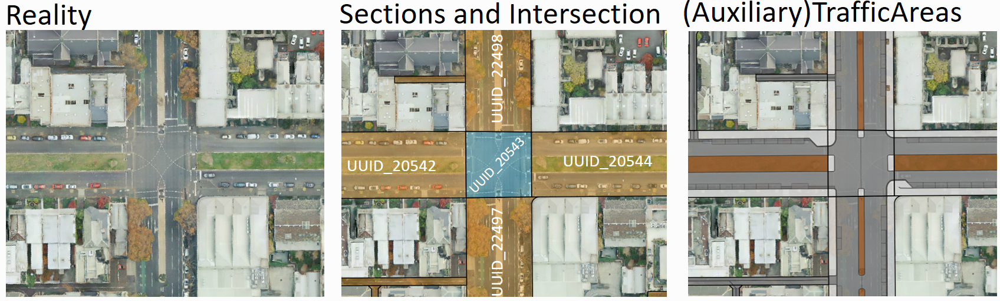

   Intersection with four adjacent Sections.

.. _xml_4way:
.. code-block:: xml
   :caption: Intersection with four adjacent Sections.

   <core:cityObjectMember>
      <tran:Road gml:id="UUID_Queensberry_Street">
         <gml:name>Queensberry_Street</gml:name>
         <tran:section>
            <tran:Section gml:id="UUID_22497">
               <!(Auxiliary)TrafficSpaces with corresponding (Auxiliary)TrafficAreas>
            </tran:Section>
         </tran:section>
         <tran:section>
            <tran:Section gml:id="UUID_22498">
               <!(Auxiliary)TrafficSpaces with corresponding (Auxiliary)TrafficAreas>
            </tran:Section>
         </tran:section>
      </tran:Road>
   </core:cityObjectMember>
   <core:cityObjectMember>
      <tran:Road gml:id="UUID_Drummond_Street">
         <gml:name>Drummond_Street</gml:name>
         <tran:section>
            <tran:Section gml:id="UUID_20544">
               <!(Auxiliary)TrafficSpaces with corresponding (Auxiliary)TrafficAreas>
            </tran:Section>
         </tran:section>
         <tran:section>
            <tran:Section gml:id="UUID_20542">
               <!(Auxiliary)TrafficSpaces with corresponding (Auxiliary)TrafficAreas>
            </tran:Section>
         </tran:section>
         <tran:intersection>
            <tran:Intersection gml:id="UUID_20543">
            <gml:name>Queensberry_Street</gml:name>
            <gml:name>Drummond_Street</gml:name>
               <!(Auxiliary)TrafficSpaces with corresponding (Auxiliary)TrafficAreas>
            </tran:Intersection>
         </tran:intersection>
      </tran:Road>
   </core:cityObjectMember>

Small roundabout
==========================================
* Small roundabouts can be modelled as an Intersection.
* The structure of the corresponding CityGML (XML) document is the same as in :numref:`xml_4way`.
* The specific type of *Intersection* (in this case 'roundabout') can be indicated with a corresponding *class* attribute.
  

   Small Roundabout modelled as *Intersection* with four adjacent *Sections*.

Large roundabout
==========================================
* While it is possible to model a large roundabout as a single *Intersection* it might be beneficial to divide large roundabouts into multiple *Sections* and *Intersections*.
* :numref:`large_roundabout` shows an example of a large roundabout segmented into multiple *Sections* (orange) and *Intersection* (blue) with corresponding *(Auxiliary)TrafficAreas* in granularity 'way'.

.. _large_roundabout:
.. figure:: ../figures/large_roundabout.png
   :align: center
   :name:  fig_large_roundabout

   A large roundabout segmented into multiple *Sections* (orange) and *Intersections* (blue).

Small side streets
==========================================
* *Sections* and *Intersection* do not need to alternate. 
* In some cases it might be useful to have several *Sections* directly next to each other.
* Especially small side streets can be modelled as individual *Sections*, that can be directly adjacent to *Sections* of larger *Roads*.

.. figure:: ../figures/smallsections.PNG
   :align: center
   :name:  fig_smallstreets

   Small side street modelled as individual Sections directly connected to larger Sections.

Dead end
==========================================
* Dead ends should be modelled as independent *Sections*
* While dead ends can be connected to another *Section* directly, it is recommended to connect dead ends with an *Intersection* as depicted in figure :numref:`deadend`.

.. _deadend:

   Dead end modelled as individual Section.

Motorway entry / exit
==========================================
* Motorway entries and exits should be modelled as individual *Sections*.
* :numref:`entryexit` shows a possible segmentation of multiple motorway entries and exits into several *Sections*.

.. _entryexit:

   Motorway entries and exits segmented into multiple *Sections*.

Integrated representation of multiple transportation types
+++++++++++++++++++++++++++++++++++++++++++++++++++++++++++++++

Roads and Railways
================================

.. admonition:: Definition
   :class: important
   
   A **Railway** is a transportation space used by wheeled vehicles on rails. This can include trains or trams. 

* *Roads* and *Railways* often do not just coexist next to each other but sometimes directly interact and share identical spaces and surfaces.
* The *Section / Intersection* concept applies to *Roads* as well as *Railways*.
* This allows an integrated (and non-redundant) modelling of both transportation types.

Railway level crossing
-----------------------
* Level crossing shared by *Roads* and *Railways* can be modelled as an *Intersection*.
* This *Intersection* then can be linked to both *FeatureTypes* using XLinks.
* *TrafficAreas* within an *Intersection* that is part of a *Road* as well as a *Railway* object, should contain multiple *function* attributes (e.g. 'driving lane' as well as 'railway lane').

.. _levelcrossing:

   Level crossing of a *Road* and a *Railway* object sharing an *Intersection*.
   

Tramway within a Road
----------------------
* Tramways within a *Road* can be modelled as *TrafficAreas* with multiple *function* attributes (e.g. railway and driving lane).
* These *TrafficAreas* can be linked to multiple *Intersections*.

.. figure:: ../figures/tramway.PNG
   :align: center
   
   A tramway within a *Road*. Surfaces of the tramway are *TrafficAreas* with multiple functions linked to respective *Intersections*. 

   
   Object diagram of a tramway surface part of multiple *Intersections*. 
   
  

Roads on Bridges
================================
* *Road* surfaces on a *Bridge* can be modelled as *TrafficAreas* (as part of a *Road*) and *RoofSurfaces* (as part of a *Bridge*) at the same time.
* In the example shown in :numref:`cityobjectrelation1`, *TrafficArea 6* and *RoofSurface 2* represent the same (geometric) surface but are part of different (semantic) objects.
* Using CityObjectRelations in order to express this relation is shown in :numref:`cityobjectrelation2`.

.. _cityobjectrelation1:

 
   Shared surfaces by Roads and Bridges using CityObjectRelations

.. _cityobjectrelation2:
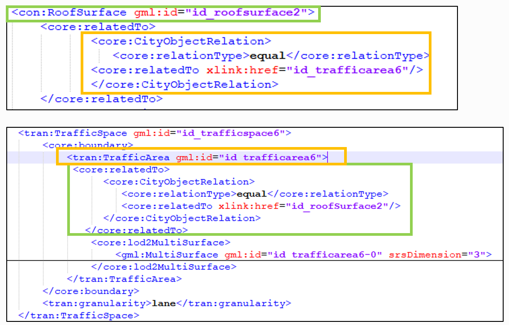
  
   *CityObjectRelation* between a *RoofSurface* and a *TrafficArea* sharing the same part of a Road on a Bridge.

.. figure:: ../figures/roadbridge.PNG
   :align: center

   TrafficAreas part of a Road are simultaneously modelled as RoofSurfaces part of a Bridge.

Roads through Tunnels
================================
* *Roads* can run trough *Tunnel* objects.

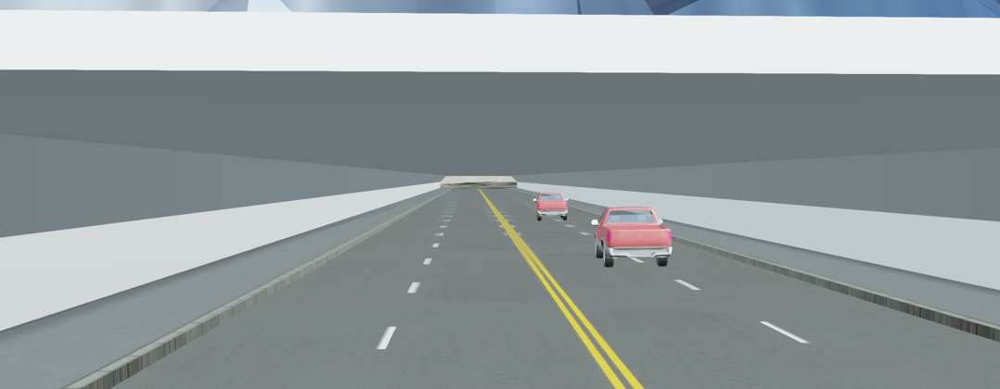
   
   Roads within a 3D model of a Tunnel. 

Roads within Buildings (Parking garage)
==========================================
* Transportation networks and *Roads* can reach into *Buildings* (e.g. within a parking garage). 
* In this case, *TrafficAreas* are also *Floor-* or *RoofSurfaces*.

.. figure:: ../figures/garage.PNG
   :align: center
   :name:  fig_garage
   

   Individual CityFurniture objects with different functions part of a CityObjectGroup.
   

.. figure:: ../figures/garage1.PNG
   :align: center
   :name:  fig_garage1
   
   Modelling shared surfaces by Buildings and Roads (e.g. within a parking garage) using CityObjectRelations.

Roads and Waterways
================================
* The same concept of shared *Intersections* of *Roads* and *Railways* also applies for *Roads* and *Waterways*.
* This can be useful to model ford crossings.

Other relevant CityGML modules 
+++++++++++++++++++++++++++++++++++++
In addition to *Roads*, other thematic parts of semantic 3D city models can be relevant for certain streetspace applications. This includes objects such as roadside *Vegetation* or *CityFurniture* (including traffic signs and lights). 

.. figure:: ../figures/streetspace.PNG
   :align: center
   :name:  fig_streetspace
   

   Components of a semantic 3D city model relevant for streetspace applications (CityGML model visualized in the Unreal Engine).

CityFurniture
================================
Concepts for modelling city furniture are provided within a specific `CityFurniture module. <https://docs.ogc.org/is/20-010/20-010.html#toc32>`_

.. admonition:: Definition
   :class: important

   **CityFurniture** is an object or piece of equipment installed in the outdoor environment for various purposes. Examples include street signs, traffic signals, street lamps, benches, trash bins, bike racks or fountains.

.. admonition:: Each CityFurniture object

   * **must** contain a unique *gml:id* attribute.
   * **should** be modelled per single object.
   * **should** contain a *function* attribute according to the CityGML codelist.
   * **should** contain a *class* attribute (e.g. to indicate sign, light or pole type)
   * **should** contain relevant information such as 2D coordinates, height information (absolute or above the ground) and orientation (e.g. azimuth angle).
   * **can** use *CityObjectRelations* to indicate validity of a certain traffic sign or light for a specific lane.

* These objects are usually represented with prototypes, which are instantiated multiple times at different locations (implicit geometries). However, it is also possible to model these objects using a simple point representation.
* Multiple logically connected objects (such as all signs and traffic lights connected to one pole) can be part of a *CityObjectGroup*.
* Many countries use standardized codes to identify different types of traffic signs (e.g. `Germany <https://en.wikipedia.org/wiki/Road_signs_in_Germany>`_). It is recommended to use these codes as *class* attributes with each traffic sign object. 

   
   Traffic signs (top) and traffic lights (bottom) and corresponding poles modelled as individual CityFurniture objects.

   
   Bus stop and other city furniture objects with corresponding function attributes.

Vegetation
================================
Concepts for modelling vegetation are provided within a specific `Vegetation module. <https://docs.ogc.org/is/20-010/20-010.html#toc40>`_

* Similar to *CityFurniture*, these objects are usually represented with prototypes using implicit geometries.
* Vegetation can be represented either as solitary vegetation objects, such as trees, bushes and ferns, or as vegetation areas that are covered by plants of a given species or a typical mixture of plant species, such as forests, steppes and wet meadows.
* *Vegetation* models can be abstract representations derived from height, trunk diameter and crown diameter information or more realistic 3D models.

.. figure:: ../figures/vegetation.PNG
   :align: center
   :name:  fig_vegetation
   
   Vegetation objects such as trees represented using abstract (left) and more detailed (right) 3D models.

Bridge
================================
Concepts for modelling bridges are provided within a specific `Bridge module. <https://docs.ogc.org/is/20-010/20-010.html#toc44>`_

.. admonition:: Definition
   :class: important

   **Bridges** are defined as a structure that affords the passage of pedestrians, animals, vehicles, and service(s) above obstacles or between two points at a height above ground. 

Tunnel
================================
Concepts for modelling tunnels are provided within a specific `Tunnel module. <https://docs.ogc.org/is/20-010/20-010.html#toc46>`_

.. admonition:: Definition
   :class: important

   **Tunnels** are defined as a horizontal or sloping enclosed passage way of a certain length, mainly underground or underwater. 

Dynamizer
================================
* The `Dynamizer module <https://docs.ogc.org/is/20-010/20-010.html#toc34>`_ provides the concepts that enable representation of time-varying data for city object properties as well as for integrating sensors with 3D city models.
* In the context of street space modelling, this can be used for linking driving lanes with dynamic information on induction loops or for representing traffic light signals.
* This `article by \Chaturvedi & Kolbe <https://www.isprs-ann-photogramm-remote-sens-spatial-inf-sci.net/IV-2-W1/31/2016/>`_ explains concepts for integration dynamic information (such as sensors) with semantic 3D city models.

.. admonition:: Definition
   :class: important

   **Dynamizers** are objects that inject time series data for an individual attribute of the city object in which the *Dynamizer* is included. In order to represent dynamic (time-dependent) variations of its value, the time series data overrides the static value of the referenced city object attribute.

Interactive online demos
+++++++++++++++++++++++++++++++++
.. tip::
   
   
   A collection of interactive visualizations of streetspace models for cities including New York City, Melbourne, Munich, and Tokyo `can be found here <https://wiki.tum.de/display/gisproject/Online+Demo+Collection>`_. 

