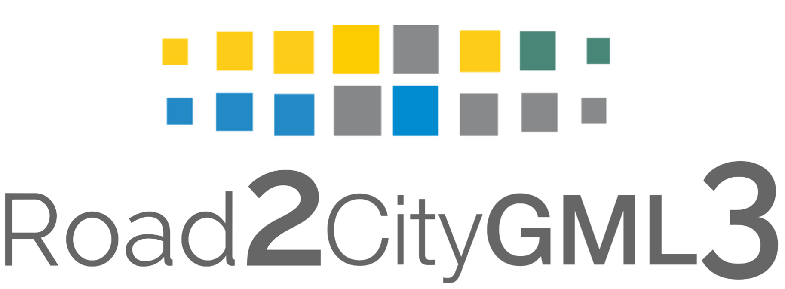

|

Road2CityGML3 - version 1.0
----------------------------

Guideline for modelling roads and the streetspace within semantic 3D city models using the international OGC standard City Geography Markup Language (CityGML) version 3.0.

.. toctree::
   :maxdepth: 3
   :numbered:
   :caption: Contents
  
   guideline/guideline
   
.. toctree::
   :maxdepth: 2
   :caption: More Information
  
   contact and citation/contactandcitation

